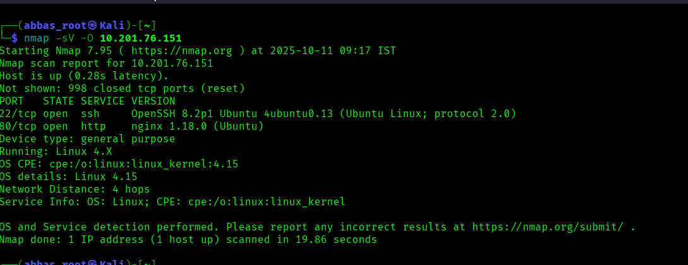
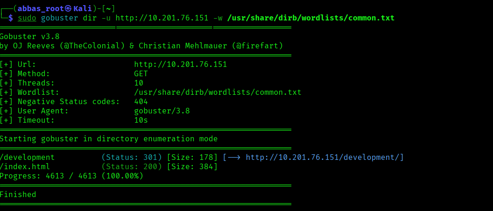
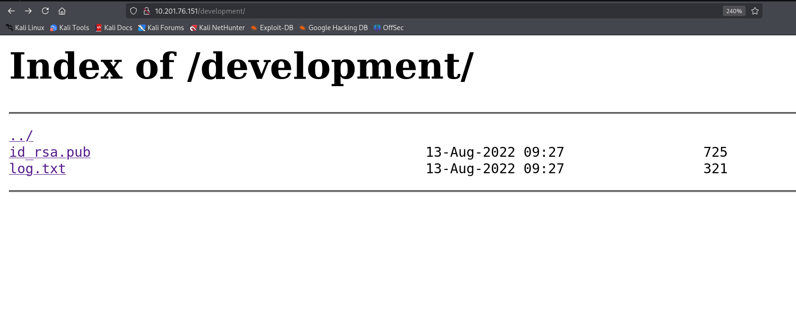
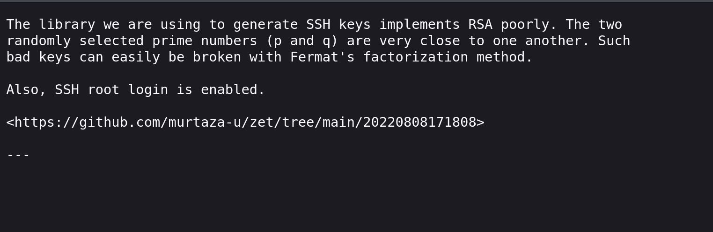
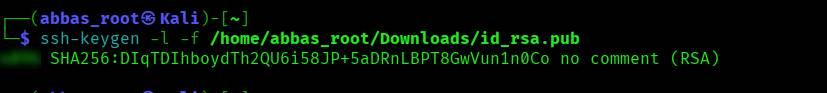
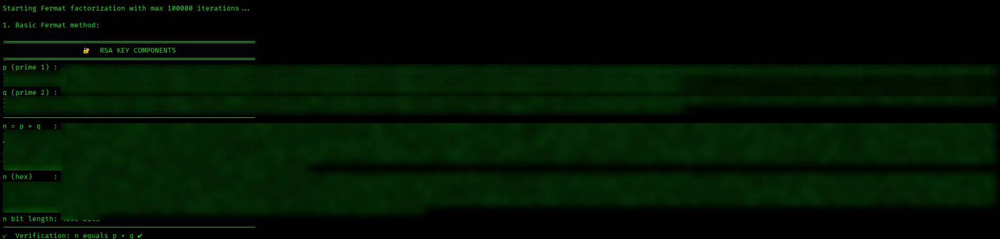
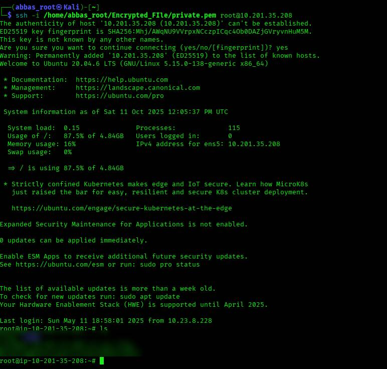

# TryHackMe : Breaking RSA

**Difficulty:**  🟠 **`Medium`**

**Source:** [https://tryhackme.com/room/breakrsa](https://tryhackme.com/room/breakrsa)

**Created by:** **`Abbas Murshid`**

## Challenge:

Exploit the poorly implemented RSA to find the two prime numbers that were used to generate the key pair.

## Room Hints:

1. RSA is more likely to break if the two large prime numbers are close to one another (P − Q is small). Fermat’s Factorization Method can help in this case (see below).
    
    

## **Tools**:

- nmap
- ssh-keygen
- pycryptodome (Python library) 
`pip install pycryptodome`
- Fermat Factorization (Python library)
- gmpy2 (handles large numeric values)
    
    `pip install gmpy2`
    
- gobuster

Let’s go!

### TASK  1: Find what services run on the target machine

I usually use Nmap to identify the services running on the target.



We find SSH on port 22 and HTTP on port 80 running on the target machine.


## TASK 2: Find hidden directory on the web server

Use Gobuster to find hidden directories on the web server.



Well done! We found a hidden directory named `development` on the web server. 

**Let’s see the contents of that directory 10.201.76.151**



**We found that two files are displayed.**

**First, check log.txt**



It’s a hint that the web server uses SSH but implements RSA insecurely.

We can find the two prime numbers using Fermat’s Factorization Method.

**The second file, id_[rsa.pub](http://rsa.pub), is the SSH public key of the target machine (click to download).**


### TASK 3: Find the length of the RSA public key

Use ssh-keygen for SSH keys.

Use the -l option to print the fingerprint of the public key; then we get the length.



So, notice that the length of the discovered SSH public key is * bytes.

### TASK 4: Find n (‘n’ is the modulus for the public–private key pair)

After a long time, I found resources on how to extract $n$ and $e$ from the public key.

Refer to the resource:

[Cybersecurity-Writeups/Concepts/Extracting_RSA_Modulus_(n)_and_Exponent_(e)_in _Pyt.md at main · AbbasMurshid/Cybersecurity-Writeups](https://github.com/AbbasMurshid/Cybersecurity-Writeups/blob/main/Concepts/Extracting_RSA_Modulus_(n)_and_Exponent_(e)_in%20_Pyt.md)

Now I will write code manually for now.

Use this snippet: 
Note: follow the instructions inside the snippet.

```python
from Crypto.PublicKey import RSA

# Load public key from file
with open("id_[rsa.pub](http://rsa.pub)" , "r") as f: 
    # replace id_[rsa.pub](http://rsa.pub) with your actual path where the key was downloaded
    key = RSA.importKey([f.read](http://f.read)())

# Display RSA components
print("Modulus N:", key.n)
print("Public Exponent E:", key.e)
```

OR

**Try my Python code tool:**

[Cybersecurity-Writeups/Tools/extract_n_e_RSA.py at main · AbbasMurshid/Cybersecurity-Writeups](https://github.com/AbbasMurshid/Cybersecurity-Writeups/blob/main/Tools/extract_n_e_RSA.py)

Step 1: simply download 

```python
wget [https://github.com/AbbasMurshid/Cybersecurity-Writeups/blob/main/Tools/extract_n_e_RSA.py](https://github.com/AbbasMurshid/Cybersecurity-Writeups/blob/main/Tools/extract_n_e_RSA.py)
```

Step 2: run Python in the terminal. 

🔥 Finally, we get the modulus of the discovered public key. 

The code below was executed using my GitHub Python tool.

.png)

Now we have n (modulus) and e. Use these to find p and q (this helps to create the private key). 
Take the last 10 digits to answer the question in TryHackMe. 👍

### TASK 5: Factorize n into p and q

Now we get into the main component! 🔥

Before getting into this, first learn `Fermat’s Factorization Method`.

I searched many materials to learn this method but none were satisfying, so I used an AI platform to learn. 
Finally, I learned the concept of this method. 

**Refer to the resource:** 👇

[Cybersecurity-Writeups/Concepts/Fermat’s_factorization_method.md at main · AbbasMurshid/Cybersecurity-Writeups](https://github.com/AbbasMurshid/Cybersecurity-Writeups/blob/main/Concepts/Fermat%E2%80%99s_factorization_method.md)

AND

[**Fermat’s Factorization Method - WIKIPEDIA
**](https://en.wikipedia.org/wiki/Fermat%27s_factorization_method) 

Okay! Now we know what Fermat’s Factorization Method is; then we move to find p and q using this mathematical algorithm →

Apply Fermat’s Factorization concept in Python.

In real RSA, large random numbers are chosen to create the key pair, so we need the gmpy2 library (which helps to handle huge numbers in code).

> gmpy2 is a high-performance mathematics library for Python, built on top of the GNU Multiple Precision Arithmetic Library (GMP).
It provides fast and precise operations on:
Large integers (mpz)
Rational numbers (mpq)
Floating-point numbers (mpfr)
Complex numbers (mpc)
> 

Click resource: 👇

[Welcome to gmpy2’s documentation! — gmpy2 2.2.2a1 documentation](https://gmpy2.readthedocs.io/en/latest/)

We have to use Python code:

My preference is to use my Fermat’s Factorization Python code (created for my own purpose).

It may be useful for you and is also user-friendly. Just choose option `2` and copy–paste the $n$ (modulus) value. 

Code resource:

[Cybersecurity-Writeups/Tools/Fermat_Factorization.py at main · AbbasMurshid/Cybersecurity-Writeups](https://github.com/AbbasMurshid/Cybersecurity-Writeups/blob/main/Tools/Fermat_Factorization.py)

**Note:This code runs 3 methods: optimized calculation, basic method follow, and iteration (it helps to understand each step).** 

OR

## use this snippet:

```
from math import floor, sqrt

def factorize(n):
    # since even numbers are always divisible by 2, one of the factors will always be 2
    if (n & 1) == 0:
        return (n/2, 2)

    a = floor(sqrt(n))

    # if n is a perfect square the factors will be (sqrt(n), sqrt(n))
    if a * a == n:
        return (a, a)

    # n = (a - b) * (a + b)
    # n = a^2 - b^2
    # b^2 = a^2 - n
    while True:
        a += 1
        _b = a * a - n
        b = int(sqrt(_b))
        if (b * b == _b):
            break

    return (a + b, a - b)

print(factorize(105327569)) # replace the number
```

Note: We need to add gmpy2 to this code. Read the resource I attached above. 👆

After we run the Python program, we get p and q values. These are used to generate the private key.



Woo-hoo! Now we have $n , e ,$ $p$ and $q$ values.

### TASK 6: Generate RSA private key

We have to implement all discovered values (n, p, q, e), then compute d (which helps to create the private key). 
Formula: 
 step 1:   $φ(n)=(p−1)×(q−1)$ 
	
step 2:  $d=e^{-1} \bmod φ(n)$

Implement this in the code snippet below:

```python
from Crypto.PublicKey import RSA

p=309894139.... # replace the value p
q=3098941.... # replace the value q
e = 655.. # replace the value e (we checked in initial steps)

def generate_private_key(p, q, e):
    """
    Generate RSA private key from p, q, e using Cryptodome.
    """
    n = p * q
    phi = (p - 1) * (q - 1)

    # Compute modular inverse of e mod phi(n)
    d = pow(e, -1, phi)

    # Build the RSA key
    key = RSA.construct((n, e, d, p, q))
    
    # Export private key in PEM format
    private_key_pem = key.export_key()
    print(private_key_pem.decode())
    print("Store key file") 
    with open("private.pem", "wb") as f:
        # replace private.pem with your own path, but ensure the extension is .pem
        f.write(private_key_pem) # correct indentation

    return key
    
generate_private_key(p,q,e)
```

File created and stored in the specified file path. Good! Now we need to connect to the target machine via SSH. 🎉

### **Final TASK: Find the Flag**

Before connecting, run `chmod 600 [file_name]` on the generated private key (stored in the directory we specified). 
Then attach the generated private key file in the SSH command. 

In my case:

```python
ssh -i Encrypted_FIle/private.pem root@10.201.35.208
```



Woo-hoo! 🙌 After all the efforts, we get a flag. 

> The art of cryptography is not in keeping secrets, but in revealing them at the right time.
> 

Goodbye, hats!!

## Disclaimer:

---

This write-up is for educational purposes only. Do not use these techniques on systems you do not own or have permission to test.
