# TryHackMe Writeup: Eviction

**Room:** [Eviction](https://tryhackme.com/room/eviction)

**Difficulty:** Easy

**Category:** Cyber Defense Frameworks / MITRE ATT&CK

## Introduction

Eviction is a challenge room on TryHackMe that focuses on Threat Intelligence. In this room, we act as a SOC analyst named "Sunny" working for E-Corp. We are tasked with using the **MITRE ATT&CK Framework** to map the Tactics, Techniques, and Procedures (TTPs) of a specific threat group: **APT28** (also known as Fancy Bear).

The goal is to use the MITRE Navigator to predict the attacker's next moves and verify if our network has been compromised.

## The Scenario

Intelligence reports suggest APT28 is targeting organizations like E-Corp. We need to answer specific questions about their attack lifecycle to "evict" them from the network.

### Step 1: Analyzing the Threat Actor

To solve this room, we first need to look at the MITRE ATT&CK page for **APT28**.

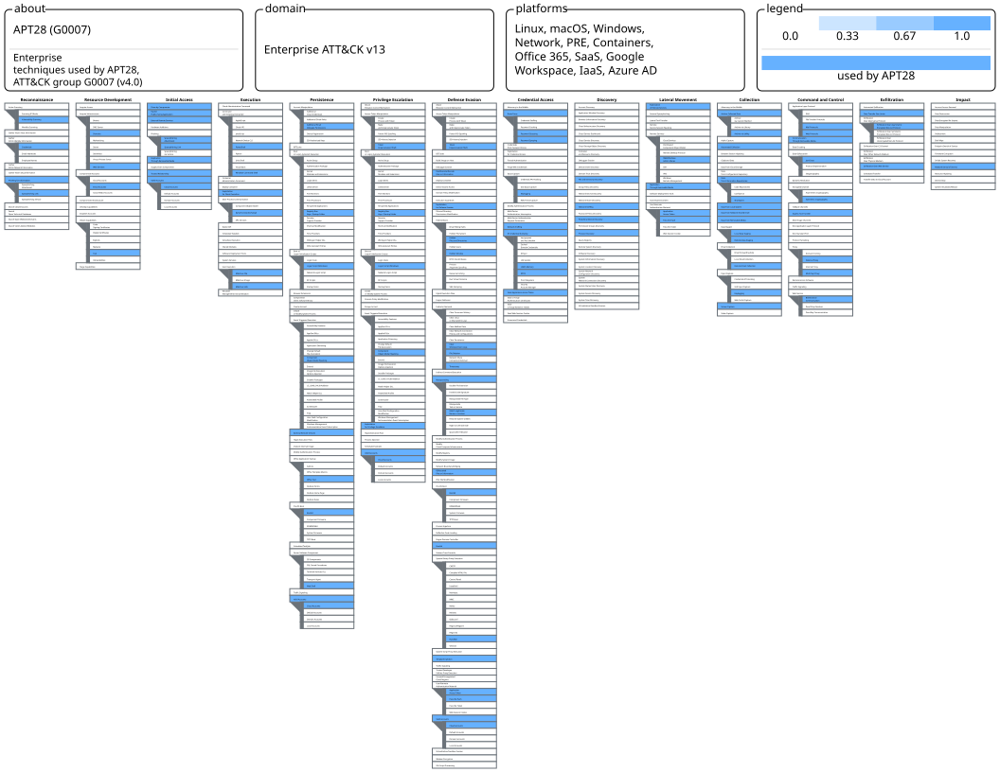

**Link:**[https://static-labs.tryhackme.cloud/sites/eviction/](https://static-labs.tryhackme.cloud/sites/eviction/)

### **Question 1 :**

**What is a technique used by the APT to both perform recon and gain initial access?**

**My Analysis:** Looking at the "Initial Access" column in the MITRE matrix for APT28, I noticed they frequently use phishing methods. Specifically, they use SpearPhishing method.

**Answer:** `[Spearphishing Link]`

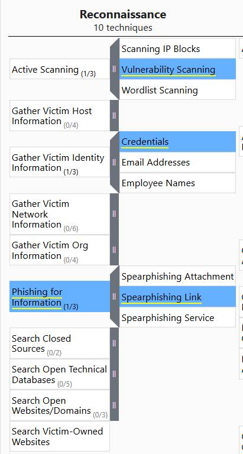

### **Question 2 :**

Sunny identified that the APT might have moved forward from the recon phase. Which accounts might the APT compromise while developing resources?

**My Analysis:** Under the "Resource Development" tactic, the framework shows that attackers often compromise existing accounts to blend in. For APT28, this specifically involves Email Account

**Answer:** `[Email account]`

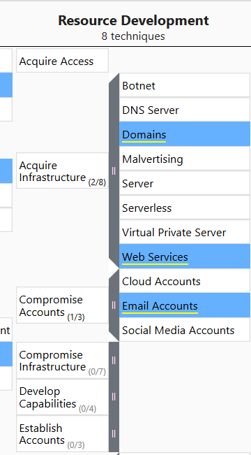

## **Question 3 :**

E-corp has found that the APT might have gained initial access using social engineering to make the user execute code for the threat actor. Sunny wants to identify if the APT was also successful in execution. What two techniques of user execution should Sunny look out for? (Answer format: <technique 1> and <technique 2>)

**My Analysis:** Moving to the "Execution" column, I looked for techniques requiring "User Execution." The matrix highlights that this group relies on the user opening files or clicking links...

**Answer:** `[Malicious file and malicious link]``

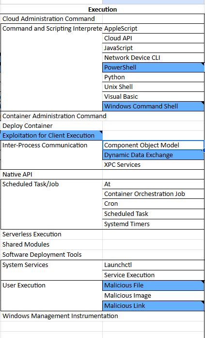

## **Question 4 :**

If the above technique was successful, which scripting interpreters should Sunny search for to identify successful execution? (Answer format: <technique 1> and <technique 2>)

**My Analysis:** Following the attack lifecycle to the **Execution** tactic, I looked for how APT28 runs their malicious code. The MITRE matrix highlights **Command and Scripting Interpreter** (T1059) as a major technique. Expanding this section revealed that this group specifically utilizes two common Windows interpreters to execute their payloads.

**Answer:** `[Powershell and Windows Command shell]`

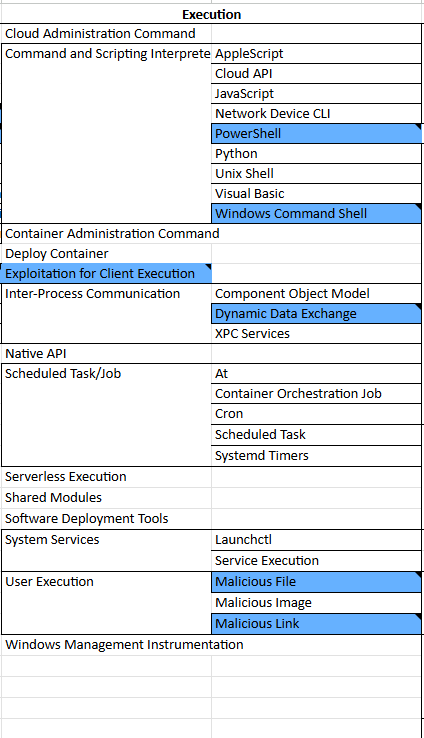

## Question 5:

While looking at the scripting interpreters identified in Q4, Sunny found some obfuscated scripts that changed the registry. Assuming these changes are for maintaining persistence, which registry keys should Sunny observe to track these changes?

**My Analysis:** I moved to the **Persistence** column of the MITRE matrix. The goal of this tactic is to maintain access even if the system is restarted. I noticed APT28 utilizes **Boot or Logon Autostart Execution** (T1547). Expanding this technique revealed that they specifically modify **Registry Run Keys** (T1547.001) to automatically execute their malicious payloads whenever a user logs in.

**Answer:** `Registry Run Keys`

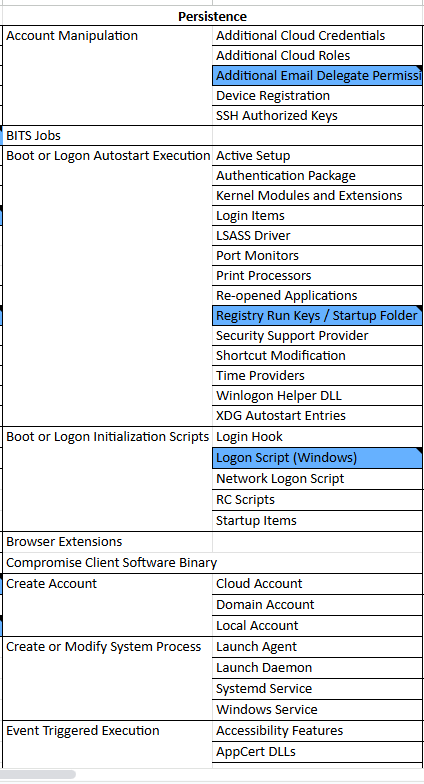

## Question 6:

Sunny identified that the APT executes system binaries to evade defences. Which system binary's execution should Sunny scrutinize for proxy execution?

**My Analysis:**
I investigated the **Defense Evasion** tactic to see how APT28 hides their malicious code. The MITRE matrix shows they use **System Binary Proxy Execution** (T1218). Specifically, they abuse **Rundll32** (T1218.011) to load malicious DLLs. This allows them to "proxy" their execution through a trusted, signed Microsoft binary, making it much harder for antivirus software to detect.

**Answer:** `[Rundll32]`

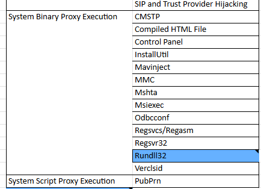

## Question 7:

Sunny identified tcpdump on one of the compromised hosts. Assuming this was placed there by the threat actor, which technique might the APT be using here for discovery?

**My Analysis :** 

The presence of **tcpdump** (a command-line packet analyzer) is a huge red flag. I looked at the **Discovery** tactic column to see how an attacker would use this tool. **Tcpdump**is used to capture data packets moving across a network. In the MITRE framework, this maps directly to **Network Sniffing** (T1040), which allows the attacker to passively discover details about other devices on the network without scanning them directly.

**Answer:** `Network Sniffing`

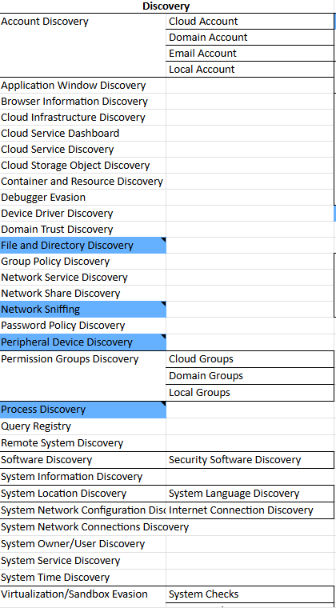

## Question 8:

It looks like the APT achieved lateral movement by exploiting remote services. Which remote services should Sunny observe to identify APT activity traces?

**My Analysis:** Moving to the **Lateral Movement** column, I needed to find how APT28 moves from one machine to another. The question hints at "exploiting remote services." Expanding the **Remote Services** (T1021) technique for this group reveals that they heavily rely on **SMB/Windows Admin Shares** (T1021.002). This allows them to copy files and execute commands on other Windows machines using valid credentials.

**Answer:** `SMB/Windows Admin Shares`

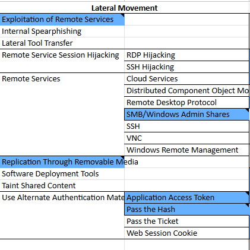

## Question 8:

It looked like the primary goal of the APT was to steal intellectual property from E-corp's information repositories. Which information repository can be the likely target of the APT?

**My Analysis:** For this question, I looked at the **Collection** tactic (TA0009), which covers how attackers gather data. The question specifically mentions "Information Repositories." Checking the **Data from Information Repositories** (T1213) technique for APT28, the intelligence shows they frequently target Microsoft **SharePoint** to find and steal internal documents and intellectual property.
**Answer:** `SharePoint`

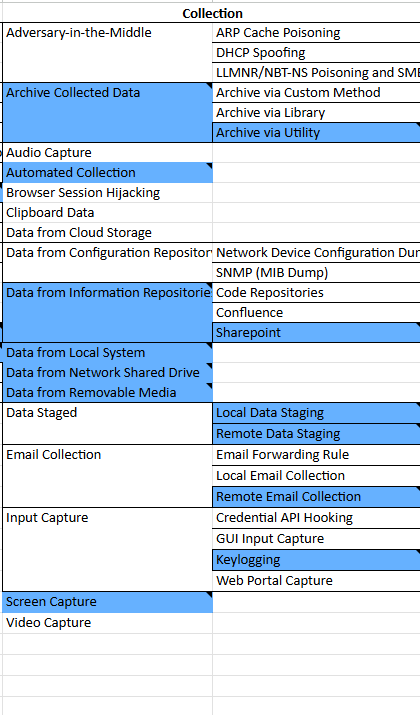

## Question 10:

Although the APT had collected the data, it could not connect to the C2 for data exfiltration. To thwart any attempts to do that, what types of proxy might the APT use? (Answer format: <technique 1> and <technique 2>)

**My Analysis :** 
Finally, I investigated the **Command and Control** (C2) tactic to see how APT28 gets data out of the network. The question mentions "proxies." Looking at the MITRE matrix for APT28 under C2, I found the **Proxy** (T1090) technique. Expanding this reveals that this group uses two specific sub-techniques to hide their traffic: **External Proxy** (T1090.002) and **Multi-hop Proxy** (T1090.003). This allows them to bounce their traffic through other servers to avoid detection.

**Answer:** `External Proxy and Multi-hop Proxy`
 

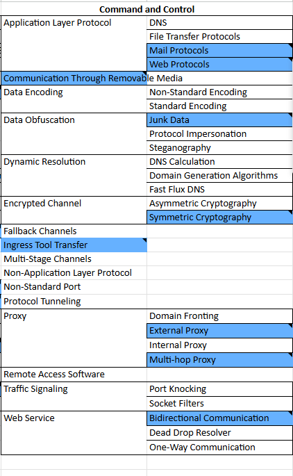

## Question 11:

`no answer needed`

### Key Takeaway: The "Living off the Land" Binary

One interesting part of this challenge was identifying **Rundll32** (Question 6). This is a classic "Living off the Land" (LotL) binary, meaning the attacker uses a legitimate Windows tool to run malicious code, making it harder to detect.

## Conclusion:

I really enjoyed the Eviction room because it forced me to step away from the terminal and think like a SOC analyst. Instead of just running scripts, I had to understand the *behavior* of an APT group. Mapping APT28's TTPs (like their use of Rundll32 and Registry Run Keys) gave me a better understanding of what to look for in real log files.
